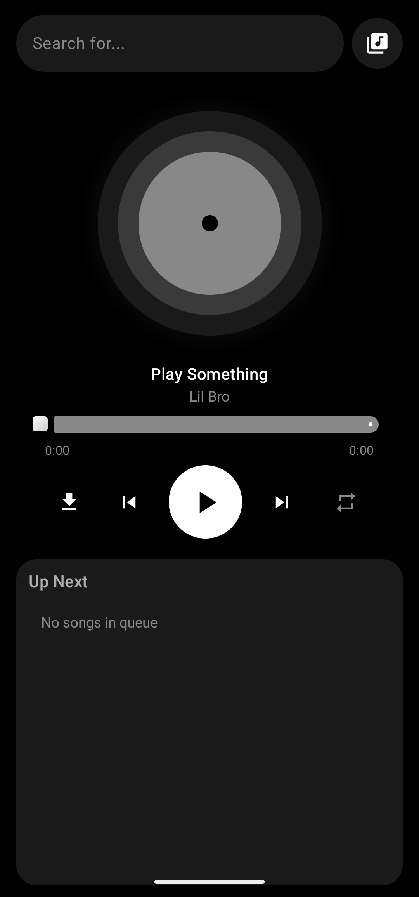
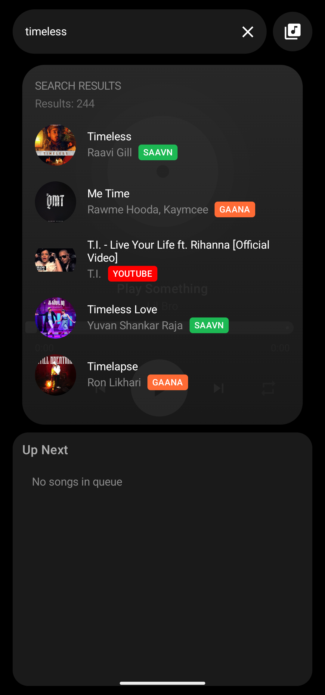
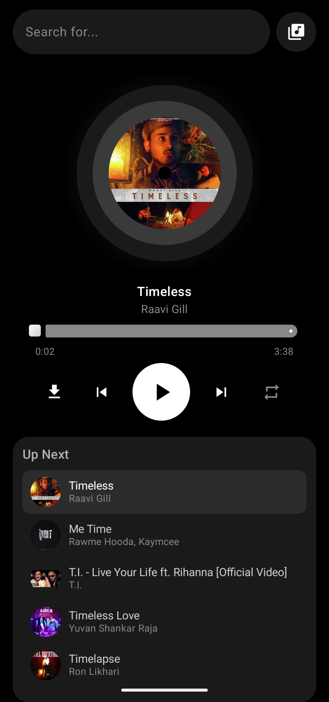
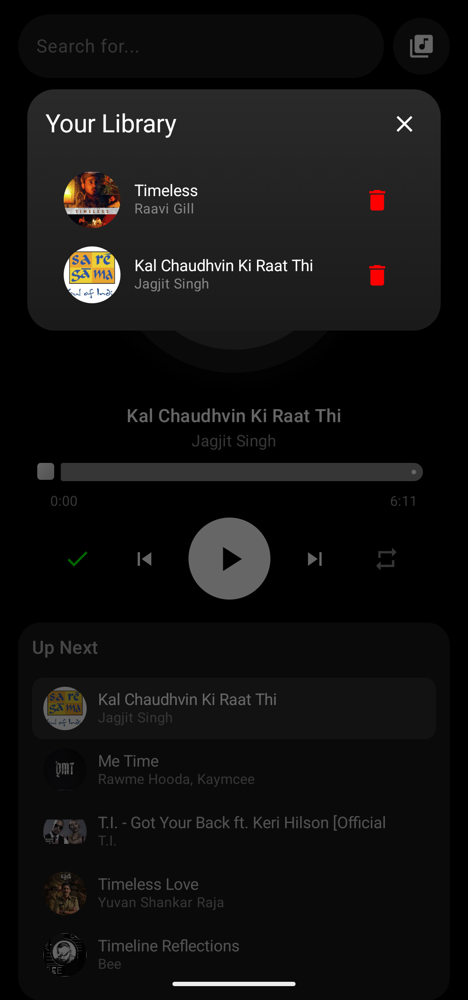

# 🎧 Ant Tunes

A modern Android music streaming app built with Kotlin + Jetpack Compose.

Stream music from multiple sources with a clean UI and smooth playback.

---

## ✨ Features

- 🔍 Search songs (Saavn + Gaana + YouTube fallback)
- 🎵 Stream high-quality audio
- 📥 Download songs (offline support)
- 🔁 Infinite queue system
- 🎧 Multi-source fallback (Saavn → Gaana → YouTube)
- ⚡ Fast & minimal UI

---

## 📸 Screenshots

  
  
  
  

---

## 📦 Download

👉 [Download Latest APK](https://github.com/YOUR_USERNAME/ant-tunes/releases/latest)

---

## 🛠 Tech Stack

- Kotlin
- Jetpack Compose
- ExoPlayer
- Retrofit
- Cloudflare Workers (Backend)

---

## ⚠️ Disclaimer

This app does not host any content.  
All media is fetched from third-party sources.

---

## ❤️ Credits

- Inspired by modern open-source music apps
- YouTube extraction via NewPipe logic

---

## 🚀 Future Plans

- SoundCloud integration
- UI redesign (glassy theme)
- Queue reordering
- Album + artist metadata
- In-app updater

---

## 🤝 Contributing

Pull requests are welcome. Feel free to fork and improve!

---

## ⭐ Support

If you like this project, give it a star ⭐
